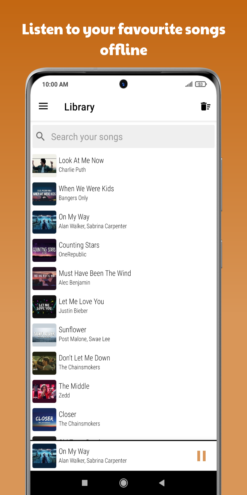
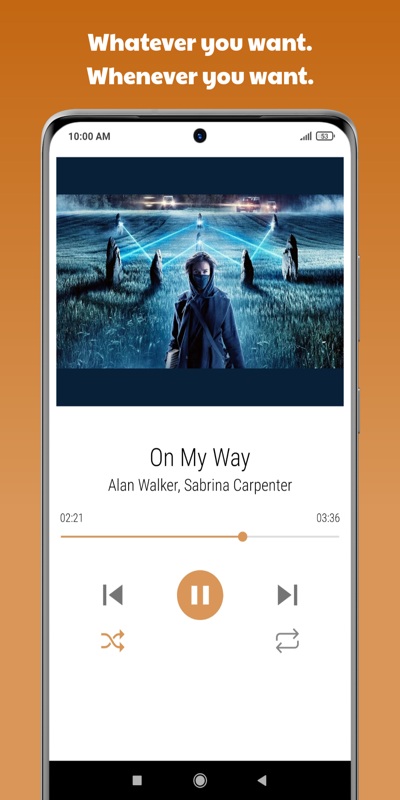

<h2 align="center"><b>Any Play</b></h2>
<h3 align="center"><b>Offline music player for Android</b></h2>

 

## Description

Download audio files from YouTube videos and listen offline.

## Screenshots

 

 

## How to use

* Find video on YouTube 
* Copy video url 
* Paste the url in the search bar and hit download 

## Features

* Search video from url 
* Display general info about the video 
* Download audio format 
* Listen to downloaded audio files 

## Installation and Updates

* Latest stable apk can be downloaded from [here]() 

* To download apk for a specific architecture, or to download previous versions, check the [releases]() page.

#### NOTE
Although [Any Play](https://github.com/MTanmay01/any-play) is capable to download audio versions of any YouTube video, music and/or song videos are preferred due to the music playing features provided by the app.

